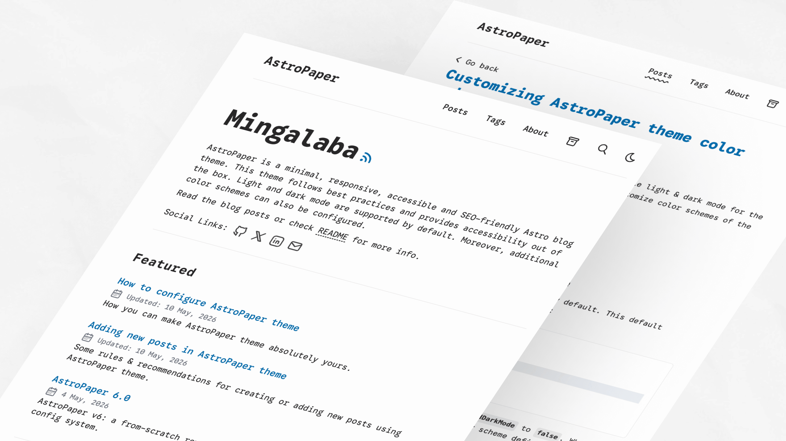
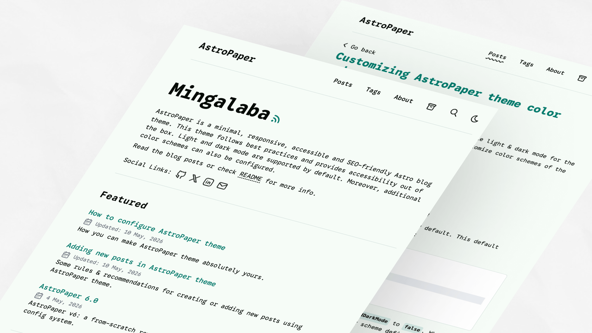
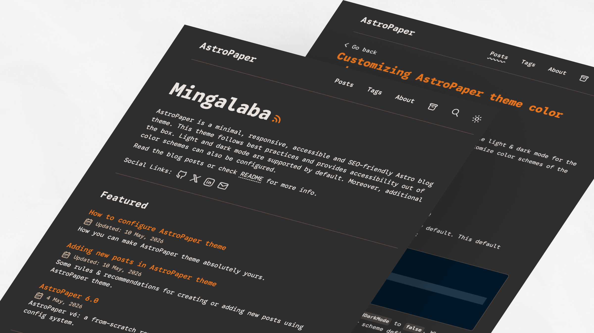

import ResponsiveTable from '@/components/ResponsiveTable.astro';

AstroPaper 包含一组预定义的配色方案，可用于自定义主题外观。每个方案都为浅色和深色模式定义了一整套 CSS 自定义属性（变量）。

## 目录

## 快速入门

要应用预定义的配色方案，请将 CSS 变量定义复制到主题配置中。详细设置说明请参见【配色方案配置指南】(https://astro-paper.pages.dev/posts/customizing-astropaper-theme-color-schemes/)。

## CSS 变量参考

所有配色方案都使用以下 CSS 自定义属性：

<ResponsiveTable variant="striped-minimal">

|变量|目的|
| -------------------- | -------------------------------------------------------------------- |
| `--background` |主要背景颜色|
| `--foreground` |主要文字颜色 |
| `--accent` |强调/交互元素（链接、按钮、突出显示）|
| `--accent-foreground` |强调背景上的文本颜色 |
| `--muted` |微妙部分的辅助背景颜色 |
| `--muted-foreground` |次要内容的文本颜色 |
| `--border` |边框和分隔线颜色 |

</ResponsiveTable>

## 灯光方案

浅色方案使用 CSS 选择器 `:root` 和 `[data-theme="light"]` 定义。

### 纸灯

默认 AstroPaper 浅色主题。


```css
:root,
[data-theme="light"] {
  --background: #fdfdfd;
  --foreground: #282728;
  --accent: #006cac;
  --accent-foreground: #ffffff;
  --muted: #e6e6e6;
  --muted-foreground: #6b7280;
  --border: #ece9e9;
}
```
### 卡扬

紫色聚焦的灯光方案与温暖的背景。


```css
:root,
[data-theme="light"] {
  --background: #fefaec;
  --foreground: #120e01;
  --accent: #6e10cf;
  --accent-foreground: #fefaec;
  --muted: #dcdcdc;
  --muted-foreground: #6b7280;
  --border: #cdc4d6;
}
```
### 尼拉

浅紫色方案带有冷蓝色底色。


```css
:root,
[data-theme="light"] {
  --background: #f6f6fb;
  --foreground: #0c0c19;
  --accent: #6760b4;
  --accent-foreground: #f3f3f3;
  --muted: #dddcea;
  --muted-foreground: #54515b;
  --border: #d8d6ec;
}
```
### 翡翠

带有中性背景的青色强调光方案。


```css
:root,
[data-theme="light"] {
  --background: #f6fcf7;
  --foreground: #060b07;
  --accent: #027c6d;
  --accent-foreground: #ffffff;
  --muted: #c9e4e2;
  --muted-foreground: #6b7280;
  --border: #d4e1df;
}
```
### 皮特·廷恩·唐

红色和金色的色调搭配温暖的色调。


```css
:root,
[data-theme="light"] {
  --background: #fffaf6;
  --foreground: #060503;
  --accent: #aa0215;
  --accent-foreground: #ffcf75;
  --muted: #ffdc98;
  --muted-foreground: #54515b;
  --border: #ffdc98;
}
```
## 黑暗计划

深色配色方案是使用 CSS 选择器 `[data-theme="dark"]` 定义的。

### 纸黑

带有青色色调的原始 AstroPaper 深色主题。


```css
[data-theme="dark"] {
  --background: #2f3741;
  --foreground: #e6e6e6;
  --accent: #1ad9d9;
  --accent-foreground: #0d2b2b;
  --muted: #596b81;
  --muted-foreground: #8faabb;
  --border: #3b4655;
}
```
### 纸黑 II

当前默认的深色主题带有橙色色调。


```css
[data-theme="dark"] {
  --background: #212737;
  --foreground: #eaedf3;
  --accent: #ff6b01;
  --accent-foreground: #ffffff;
  --muted: #343f60;
  --muted-foreground: #afb9ca;
  --border: #ab4b08;
}
```
### 深紫色

充满活力的洋红色强调深色方案。


```css
[data-theme="dark"] {
  --background: #212737;
  --foreground: #eaedf3;
  --accent: #eb3fd3;
  --accent-foreground: #1a0d1a;
  --muted: #513f51;
  --muted-foreground: #c09abc;
  --border: #642451;
}
```
### 余烬

温暖、柔和的深色方案搭配红色点缀。


```css
[data-theme="dark"] {
  --background: #1a1a1a;
  --foreground: #f5efe4;
  --accent: #ff3737;
  --accent-foreground: #1a1a1a;
  --muted: #38342f;
  --muted-foreground: #a59a8c;
  --border: #6f5648;
}
```
### 浓缩咖啡

以棕色为主的暖暗方案。


```css
[data-theme="dark"] {
  --background: #2f2f2f;
  --foreground: #ebe5e1;
  --accent: #ee781e;
  --accent-foreground: #1a1a1a;
  --muted: #4f4b44;
  --muted-foreground: #ddbfa7;
  --border: #6f5648;
}
```
