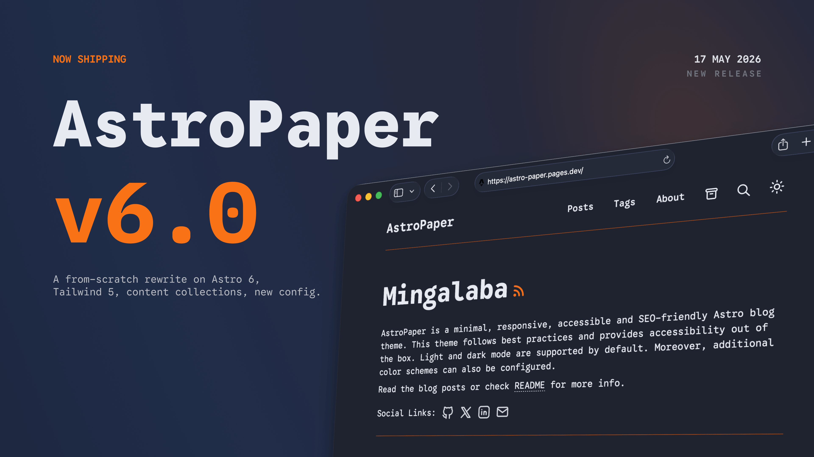

AstroPaper v6 是基于 Astro v6、Tailwind CSS v4 和 TypeScript v6 的完全重写。此版本用单个统一配置文件替换了旧的 `SITE` / `constants.ts` 配置，并在代码库中引入了多项结构改进。



## 目录

## 主要变化

### 升级到 Astro v6

AstroPaper 现在附带 Astro v6.3，其中包括：

- **稳定的内容层 API** — `glob()` 加载器取代了旧的 `type: "content"` 集合模式。
- **稳定字体 API** — `experimental.fonts` 已升级为 `astro.config.ts` 中的顶级 `fonts` 键。
- **TypeScript v6** — 完全支持最新的 TypeScript 编译器。

### 新的统一配置系统

`src/config.ts` 中的平面`SITE` 对象和单独的`constants.ts` 文件已被项目根目录下的单个`astro-paper.config.ts` 替换。使用 `defineAstroPaperConfig()` 实现完整的 IntelliSense：

```ts file="astro-paper.config.ts"
import { defineAstroPaperConfig } from "./src/types/config";

export default defineAstroPaperConfig({
  site: {
    url: "https://your-site.com/",
    title: "AstroPaper",
    description: "…",
    author: "Your Name",
    lang: "en",
    timezone: "UTC",
    googleVerification: "your-verification-value",
  },
  posts: {
    perPage: 4,
    perIndex: 4,
    scheduledPostMargin: 15 * 60 * 1000, // ms
  },
  features: {
    lightAndDarkMode: true,
    dynamicOgImage: true,
    showArchives: true,
    showBackButton: true,
    editPost: { enabled: true, url: "https://github.com/…/edit/main/" },
    search: "pagefind",
  },
  socials: [{ name: "github", url: "https://github.com/…" }],
  shareLinks: [{ name: "x", url: "https://x.com/intent/post?url=" }],
});
```

所有选项（站点元数据、分页、功能标志、社交链接和共享链接）现在都位于一个文件中。

### 稳定字体 API

字体配置已从`experimental.fonts`升级为`astro.config.ts`中的顶级`fonts`键，匹配Astro v6的稳定API：

```ts file="astro.config.ts"
export default defineConfig({
  fonts: [
    {
      name: "Google Sans Code",
      cssVariable: "--font-google-sans-code",
      provider: fontProviders.google(),
      weights: [300, 400, 500, 600, 700],
      styles: ["normal", "italic"],
    },
  ],
});
```

### MDX 支持

`@astrojs/mdx` 现已包含在内。帖子可以使用 `.mdx` 扩展来嵌入组件、使用 JSX 表达式以及从其他文件导入。内容加载器模式 `**/[^_]*.{md,mdx}` 自动选择两种格式。

### 内容集合重组

博客文章已从 `src/data/blog/` 移至 `src/content/posts/`，与 Astro 惯例保持一致。 `src/content/pages/` 上的新 `pages` 集合涵盖独立页面（关于等）。 `posts` 集合使用 Astro 的 `glob()` 加载器 — `defineCollection` 和 `type: "content"` 不再使用：

```ts file="src/content.config.ts"
const posts = defineCollection({
  loader: glob({ pattern: "**/[^_]*.{md,mdx}", base: "./src/content/posts" }),
  schema: ({ image }) =>
    z.object({
      author: z.string(),
      pubDatetime: z.date(),
      title: z.string(),
      tags: z.array(z.string()).default(["others"]),
      description: z.string(),
      // …
    }),
});
```

### 设计代币系统

v5 中的 5 个令牌调色板在 `src/styles/theme.css` 中已增加到 7 个令牌。令牌被定义为 CSS 自定义属性并通过 `@theme inline` 注册到 Tailwind v4：

````css file="src/styles/theme.css"
@theme inline {
  --color-background: var(--background);
  --color-foreground: var(--foreground);
  --color-accent: var(--accent);
  --color-accent-foreground: var(--accent-foreground);
  --color-muted: var(--muted);
  --color-muted-foreground: var(--muted-foreground);
  --color-border: var(--border);
}

:root,
[data-theme="light"] {
  --background: #fdfdfd;
  --foreground: #282728;
  --accent: #006cac;
  --accent-foreground: #ffffff;
  --muted: #e6e6e6;
  --muted-foreground: #6b7280;
  --border: #ece9e9;
}

[data-theme="dark"] {
  --background: #212737;
  --foreground: #eaedf3;
  --accent: #ff6b01;
  --accent-foreground: #ffffff;
  --muted: #343f60;
  --muted-foreground: #afb9ca;
  --border: #ab4b08;
}
`
```theme.css` 是由`global.css` 导入的单独文件。这两个新代币是`--accent-foreground`和`--muted-foreground`。

### i18n 字符串提取

所有UI字符串都通过`UIStrings`接口提取到`src/i18n/lang/en.ts`。添加新语言只需要在`src/i18n/lang/`中创建一个新文件：
```ts file="src/i18n/lang/en.ts"
export default {
  nav: { home: "Home", posts: "Posts" /* … */ },
  post: { publishedAt: "Published at" /* … */ },
  /* … */
} satisfies UIStrings;
`
```tplStr()` 帮助器处理参数化字符串，以便翻译人员可以自由地重新排序标记。

### 基本路径和子目录部署支持

所有内部链接都经过 `getRelativeLocaleUrl()` 和 `withBase.ts` 帮助器（`stripLocale`、`stripBase`、`getAssetPath`）。部署到子目录（例如`/astro-paper`）无需手动更新链接。

### 通过配置进行 Google 站点验证

设置 Google 站点验证的首选方法是 `astro-paper.config.ts` 中的 `site.googleVerification`：
```ts file="astro-paper.config.ts"
export default defineAstroPaperConfig({
  site: {
    // …
    googleVerification: "your-google-site-verification-value",
  },
});
````

在您不希望将值提交到配置文件的情况下，仍然支持 `PUBLIC_GOOGLE_SITE_VERIFICATION` 环境变量作为后备。

```bash file=".env"
PUBLIC_GOOGLE_SITE_VERIFICATION=your-google-site-verification-value
```

当两者都设置时，`site.googleVerification`优先。

## 其他显着变化

- 更新并重命名了 helper/util 函数。
- 相邻的帖子导航（上一个/下一个）现在在 `getStaticPaths` 中计算一次并作为 props 传递 - 该组件不再获取每页的所有帖子。
- `_components/`范围：特定于后的组件位于`pages/posts/[...slug]/_components/`下，不会污染全局`src/components/`目录。
- `PostLayout.astro` 仅处理结构化数据和 SEO - 发布页面逻辑位于页面文件本身中。

## 总结

AstroPaper v6 保留了其简约、干净的外观，同时围绕 Astro v6 的新基元重建了内部结构。配置系统更简单，代码库更容易导航，并且主题已准备好进行 i18n 和开箱即用的子目录部署。

## 另请参阅

- [预定义的配色方案](/posts/predefined-color-schemes/)
- [如何配置 AstroPaper 主题](/posts/how-to-configure-astropaper-theme/)
- [在 AstroPaper 中添加新帖子](/posts/adding-new-posts-in-astropaper-theme)
