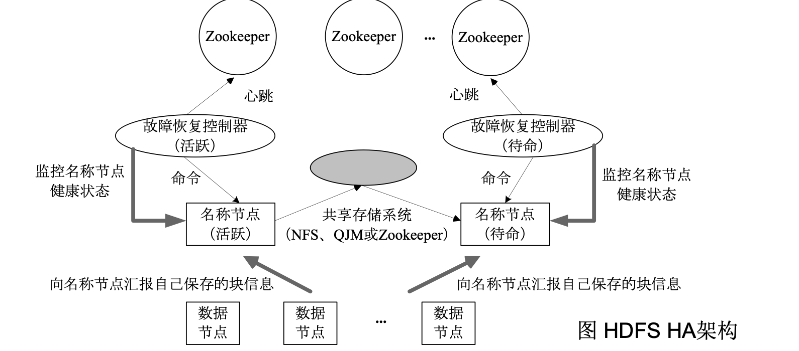

# Hadoop
## 第七章
### MapReduce模型介绍

- MapReduce 将运行在大规模集群上的复杂并行计算过程，高度抽象为两个函数：**Map** 和 **Reduce**。

- MapReduce 编程相对容易。开发者不需要掌握分布式并行编程的具体细节，也可以将程序运行在分布式系统上，完成海量数据的计算。

- MapReduce 采用“**分而治之**”的策略。存储在分布式文件系统中的大规模数据集会被划分为多个独立的分片（Split），这些分片可以由多个 Map 任务并行处理。

- MapReduce 的设计理念之一是“**计算向数据靠拢**”，而不是“数据向计算靠拢”，因为移动大量数据会产生较高的网络传输开销。

- 在 Hadoop 1.x 中，MapReduce 框架采用 **Master/Slave** 架构：

  - Master 节点运行 **JobTracker**

  - Slave 节点运行 **TaskTracker**

- Hadoop 框架本身使用 Java 实现，但 MapReduce 应用程序不一定必须使用 Java 编写。

### JobTracker
- **JobTracker** 负责集群中的资源监控和作业调度。

- JobTracker 会监控所有 **TaskTracker** 和作业（Job）的运行状态。若发现任务执行失败，会将相应任务重新调度到其他节点上执行。

- JobTracker 会持续跟踪任务的执行进度、资源使用情况等信息，并将这些信息提供给任务调度器 **TaskScheduler**。

- 当集群中出现空闲资源时，TaskScheduler 会选择合适的任务，并将其分配到可用资源上执行。

## 第八章
### HDFS HA

- **HDFS HA（High Availability，高可用）**用于解决 NameNode 的单点故障问题。

- HA 集群通常配置两个 NameNode：

  - **Active NameNode**：负责对外提供服务。

  - **Standby NameNode**：保持待命状态，并持续同步元数据。

- Active NameNode 和 Standby NameNode 之间需要保持元数据同步，可以通过共享存储系统实现。

- 当 Active NameNode 发生故障时，系统可以将服务切换到 Standby NameNode，使其成为新的 Active NameNode。

- **ZooKeeper** 用于协调主备切换，确保同一时间只有一个 NameNode 对外提供服务，避免出现两个 Active NameNode。

- 两个 NameNode 都维护文件与数据块之间的映射信息，DataNode 会同时向两个 NameNode 汇报数据块和运行状态信息。

### ResourceManager 

## 第九章
### 数据湖的概念、全量数据、数据湖的本质、两类数据处理工具的作用

## 数据湖

随着企业持续发展，企业数据也在不断积累。虽然价值较高的数据通常存放在数据库和数据仓库中，用于支撑企业日常运转，但企业往往还希望完整保存生产经营过程中产生的所有相关数据，包括：

- 历史数据与实时数据
- 在线数据与离线数据
- 内部数据与外部数据
- 结构化数据与非结构化数据

保存这些数据的目的是方便企业日后进行分析和挖掘，从海量数据中发现潜在价值。

传统数据库和数据仓库难以完整承担这一任务，因此出现了**数据湖（Data Lake）**。

### 数据湖的概念

数据湖是一种以数据的自然格式或原始格式保存数据的系统或存储架构，底层通常采用对象存储或文件存储。

数据湖通常作为企业全量数据的统一存储位置。

### 全量数据

数据湖中的全量数据包括：

- 原始业务系统产生的原始数据副本
- 为不同数据处理任务产生的转换数据

这些数据可以用于：

- 报表
- 数据可视化
- 高级分析
- 机器学习

按照数据类型划分，数据湖中可以包含：

- **结构化数据**：关系数据库中的行和列
- **半结构化数据**：CSV、日志、XML、JSON 等
- **非结构化数据**：E-mail、文档、PDF 等
- **二进制数据**：图像、音频、视频等

数据湖既可以构建在企业本地数据中心，也可以构建在云平台上。

## 数据湖的本质

数据湖的本质是由以下两部分组成的解决方案：

> **数据存储架构 + 数据处理工具**

因此，数据湖不是某个单一、独立的产品。

### 数据存储架构

数据湖的存储架构需要具备足够的：

- 扩展性
- 可靠性
- 存储容量

它需要保证企业能够将所有原始数据长期保存下来，即做到：

- 存得下
- 存得久
- 可以持续扩展

云厂商通常使用对象存储作为数据湖的存储底座。例如，Amazon Web Services 使用 **Amazon S3** 作为数据湖的底层对象存储。

## 数据处理工具

数据湖中的数据处理工具主要分为两类。

### 第一类：数据移动与管理工具

第一类工具负责将数据“搬到”数据湖中，主要功能包括：

- 定义数据源
- 制定数据访问策略
- 制定数据安全策略
- 移动数据
- 执行 ETL
- 编制数据目录
- 管理元数据
- 进行数据治理

如果缺少数据管理和治理工具，数据湖中的元数据和数据质量就无法得到保障。各种未经整理的数据不断进入数据湖，可能使数据湖逐渐变成难以使用的“**数据沼泽**”。

因此，数据移动和数据管理工具是数据湖方案中的重要组成部分。

例如，Amazon Web Services 提供：

- **AWS Lake Formation**：自动将不同数据源中的数据移动到数据湖中
- **AWS Glue**：执行 ETL、管理元数据并编制数据目录

### 第二类：数据分析与计算工具

第二类工具负责从数据湖中的海量数据中发现和提取价值，也就是从数据中“淘金”。

数据存入数据湖后，还需要进行进一步的：

- 查询
- 分析
- 挖掘
- 利用
- 机器学习
- 数据科学处理

数据湖可以通过不同的计算引擎支持多种数据分析场景，包括：

- 离线分析
- 实时分析
- 交互式分析
- 机器学习
- 数据科学计算

## 两类工具的作用总结

| 工具类型 | 主要作用 |
| --- | --- |
| **数据移动与管理工具** | 将数据导入数据湖，并完成数据源管理、访问控制、安全管理、ETL、元数据管理和数据目录建设，避免数据湖变成“数据沼泽” |
| **数据分析与计算工具** | 对数据湖中的数据进行查询、分析、挖掘和机器学习，从海量数据中提取业务价值 |