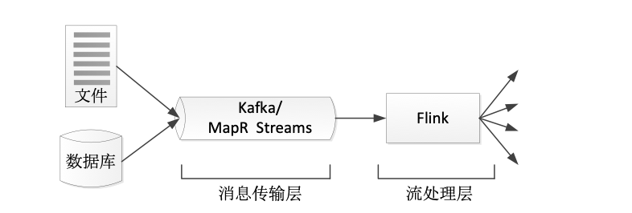
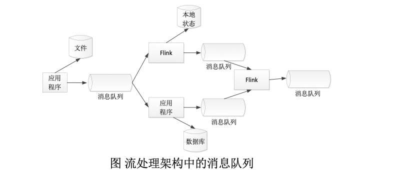

# Hadoop
## 第十章
### RDD的惰性调用和执行过程、宽依赖和窄依赖、阶段的划分。

## RDD 的惰性调用（Lazy Evaluation）

RDD（Resilient Distributed Dataset）的一个核心特性是 **惰性执行**。

### 基本概念

- RDD 的所有 **Transformation（转换操作）不会立即执行**
- 只有遇到 **Action（行动操作）时才真正触发计算**

### 常见 Transformation（不会立即执行）

- map
- flatMap
- filter
- groupByKey
- reduceByKey

### 常见 Action（触发执行）

- collect
- count
- take
- saveAsTextFile

### 执行特点

- Spark 会先记录所有 transformation，构建 **DAG（有向无环图）**
- 不立即计算，避免不必要的中间结果
- 优化执行路径（如 pipeline 合并）

---

## RDD 的执行过程

RDD 的整体执行流程：

1. 用户编写 transformation
2. Spark 构建 **DAG**
3. 遇到 action 触发执行
4. DAG 被切分成多个 stage
5. 每个 stage 内部形成 task
6. task 在集群中并行执行
7. 返回结果或写入存储

---

## 宽依赖与窄依赖

RDD 之间的依赖关系分为两类：**窄依赖（Narrow Dependency）** 和 **宽依赖（Wide Dependency）**

---

### 1. 窄依赖（Narrow Dependency）

#### 定义
每个父 RDD 的 partition 最多只被一个子 RDD partition 使用。

#### 特点

- 不发生 shuffle
- 数据本地传递
- 计算效率高
- 可以 pipeline 执行

#### 常见操作

- map
- filter
- union（部分情况）

---

### 2. 宽依赖（Wide Dependency）

#### 定义
一个父 RDD 的 partition 会被多个子 RDD partition 使用。

#### 特点

- 发生 shuffle
- 需要跨节点数据传输
- 成本高
- 会触发 stage 切分

#### 常见操作

- groupByKey
- reduceByKey
- join
- distinct

---

## Stage 的划分机制

Spark 会根据 **宽依赖来划分 Stage**

### 核心规则

- **窄依赖：同一个 stage 内执行**
- **宽依赖：stage 分界点（shuffle）**

---

### Stage 划分逻辑

1. 从 action 开始反向回溯 DAG
2. 遇到宽依赖 → 切分 stage
3. 遇到窄依赖 → 合并到同一 stage
4. 形成多个 stage

## 第十一章
### 流计算
流计算的处理流程一般包含三个阶段：数据实时采集、数据实时计算、实时查询服务

流计算适合于需要处理持续到达的流数据、对数据处理有较高实时性要求的场景  

传统的业务分析一般采用分布式离线计算的方式，即将数据全部保存起来，然后每隔一定的时间进行离线分析来得到结果。但这样会导致一定的延时，难以保证结果的实时性
随着分析业务对实时性要求的提升，离线分析模式已经不适合用于流数据的分析，也不适用于要求实时响应的互联网应用场景
如淘宝网“双十一”、“双十二”的促销活动，商家需要根据广告效果来即时调整广告，这就需要对广告的受访情况进行分析。但以往采用分布式离线分析，需要几小时甚至一天的延时才能得到分析结果。而促销活动只持续一天，因此，隔天才能得到的分析结果便失去了价值
虽然分布式离线分析带来的小时级的分析延时可以满足大部分商家的需求，但随着实时性要求越来越高，如何实现秒级别的实时分析响应成为业务分析的一大挑战  

流计算不仅为互联网带来改变，也能改变我们的生活
如提供导航路线，一般的导航路线并没有考虑实时的交通状况，即便在计算路线时有考虑交通状况，往往也只是使用了以往的交通状况数据。要达到根据实时交通状态进行导航的效果，就需要获取海量的实时交通数据并进行实时分析
借助于流计算的实时特性，不仅可以根据交通情况制定路线，而且在行驶过程中，也可以根据交通情况的变化实时更新路线，始终为用户提供最佳的行驶路线

## 第十二章
### 流处理架构

为了高效地实现流处理架构，一般需要设置消息传输层和流处理层（如图所示）。消息传输层从各种数据源采集连续事件产生的数据，并传输给订阅了这些数据的应用程序；流处理层会持续地将数据在应用程序和系统间移动，聚合并处理事件，并在本地维持应用程序的状态。  

流处理架构的核心是使各种应用程序互连在一起的消息队列，消息队列连接应用程序，并作为新的共享数据源，这些消息队列取代了从前的大型集中式数据库。如图所示，流处理器从消息队列中订阅数据并加以处理，处理后的数据可以流向另一个消息队列，这样，其他应用程序都可以共享流数据。在一些情况下，处理后的数据会被存放到本地数据库中。

